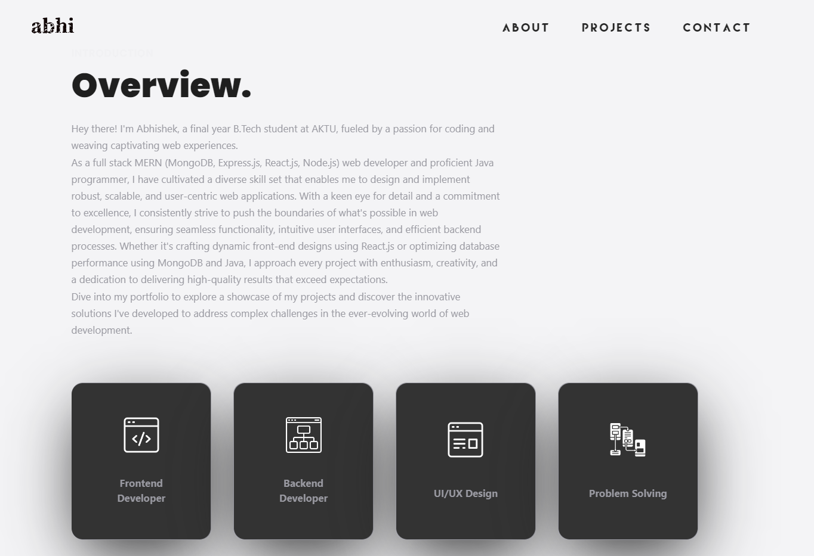
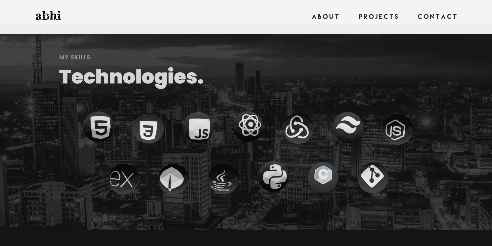
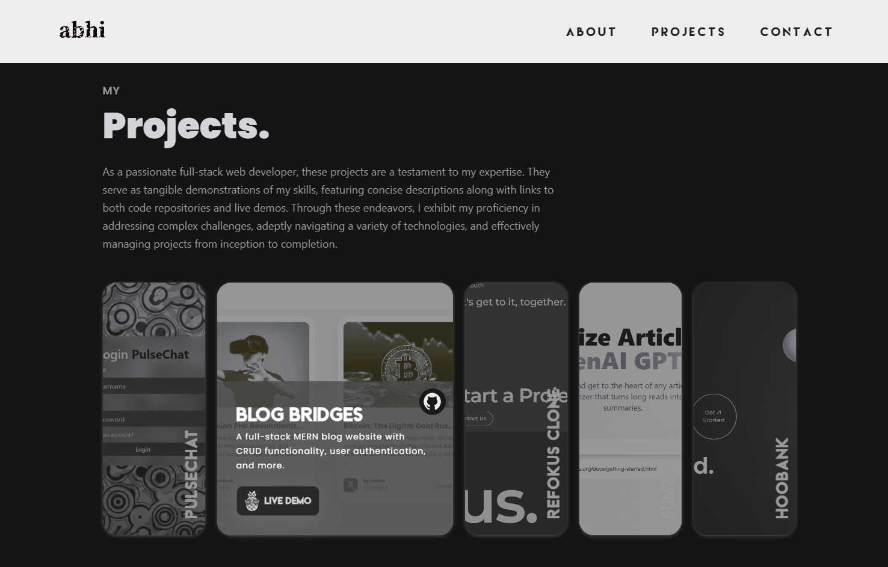
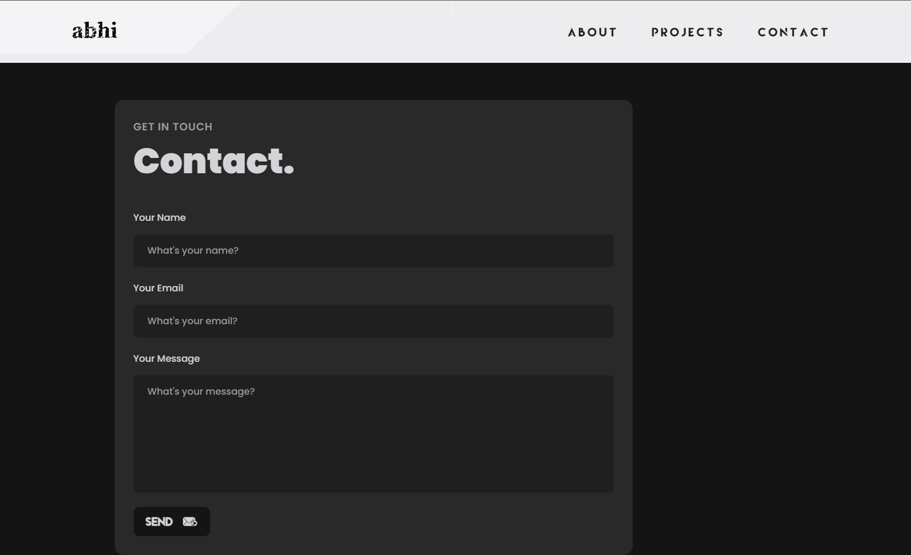

# Portfolio using React, Tailwind CSS, Framer Motion, and Three.js ✨

This is a portfolio website built using React, Tailwind CSS, Framer Motion, and Three.js. It showcases my skills, projects, and experiences.

## Features

-   Interactive Design: Utilizes Framer Motion for smooth animations and transitions.
-   3D Graphics: Implements Three.js to create dynamic and interactive 3D graphics.
-   Responsive Layout: Built with Tailwind CSS to ensure a responsive design across all devices.
-   Modular Components: Developed with React for a component-based architecture, making it easy to maintain and extend.

## Technologies Used

-   React: JavaScript library for building user interfaces.
-   Tailwind CSS: Utility-first CSS framework for styling.
-   Framer Motion: Library for creating animations and transitions in React applications.
-   Three.js: JavaScript library for creating 3D graphics in the browser.

## Screenshots

